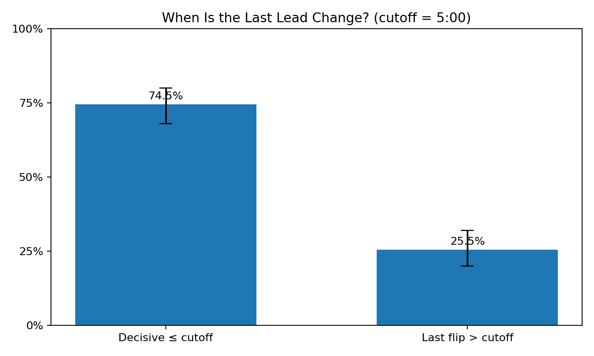
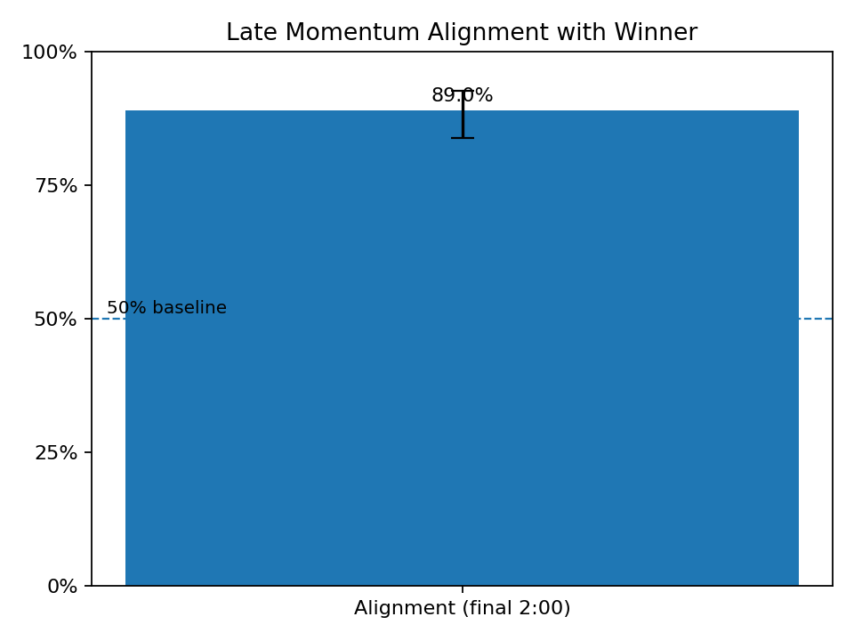
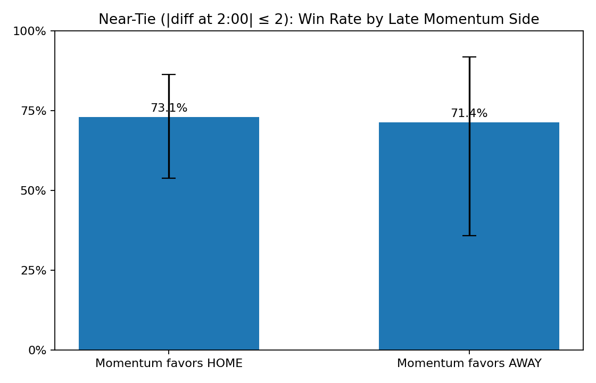
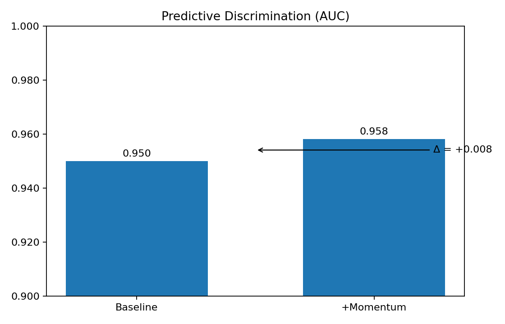

# The Momentum Factor — NBA Momentum Analysis

This project quantifies in-game momentum from NBA play-by-play data. It constructs a standardized scoring timeline (including OT handling), derives momentum-oriented indicators (rolling differential, scoring runs, lead swing magnitude, stability), and evaluates whether momentum aligns with and predicts outcomes at season scale.

## Structure
- `notebooks/01_single_game_walkthrough.ipynb` — Case study on one game (method illustration & visuals).
- `notebooks/02_season_scale_analysis.ipynb` — Season-scale dataset, decisive-lead-change rates, late-momentum alignment, and predictive lift (AUC).
- `scripts/momentum_utils.py` — Reusable utilities for processing play-by-play and deriving features.
- `tests/` — Smoke test for the pipeline.
- `data/` — Raw/processed CSVs (git-ignored by default).
- `visuals/` — Exported figures.

## Quickstart
```bash
python3 -m venv venv
source venv/bin/activate
pip install --upgrade pip
pip install -r requirements.txt
python -m ipykernel install --user --name momentum-factor-venv --display-name "Python (momentum-factor)"
```

Open the notebooks in VS Code or Jupyter and select the **Python (momentum-factor)** kernel.

## Notes
- Play-by-play via `nba_api` is rate-limited; the season-scale notebook samples games to stay responsive.
- Results express predictive association, not causal effects.

## Momentum at Scale — Key Findings

**Data & Methods.** Event-level play-by-play is converted into a continuous scoring differential (home − away). A short-horizon **Momentum Index** (rolling average over recent events) summarizes flow. Game-level signals include the **time of the last lead change**, **late momentum** (mean Momentum Index in the final 2:00), **run magnitude**, and **stability** (inverse variance). We evaluate decision relevance and predictive value across a season sample.

### 1) When do games get decided?


The final lead change occurs **before the 5:00 mark** in roughly **74.5%** of games. Only **25.5%** of games see the last flip after 5:00. Practically, many contests are **functionally decided** prior to the closing possessions, underscoring the value of recognizing decisive swings early (timeouts, lineup changes, pace control).

### 2) Does late momentum align with winners?


Across all games, the sign of the **final-2:00 Momentum Index** aligns with the eventual winner **89.0%** of the time. This suggests short-horizon momentum captures endgame dynamics that the scoreboard alone does not fully convey.

### 3) What happens when the score is basically tied?


Conditioning on **near-tie states** at 2:00 (|score diff| ≤ 2), the team with late momentum wins about **73.1%** of the time when momentum favors **home**, and **71.4%** when it favors **away**. Momentum remains outcome-relevant **even after** controlling for a tight scoreboard.

### 4) Is momentum predictive beyond score checkpoints?


A baseline classifier using score checkpoints (start of Q4, score at 2:00) and an OT flag achieves **AUC = 0.950**. Adding momentum features (late Momentum Index, max run points, stability) improves performance to **AUC = 0.958** (**Δ = +0.008**). The baseline is already strong; the **incremental lift** indicates momentum adds non-trivial predictive signal rather than merely replaying the score.

**Caveats.** Results are associational and depend on window definitions. Robustness checks (alt windows 1–3 minutes, decisive cutoff 3–7 minutes, OT exclusion) are included in the notebook to validate stability. Team strength and opponent effects can be layered in future iterations.
